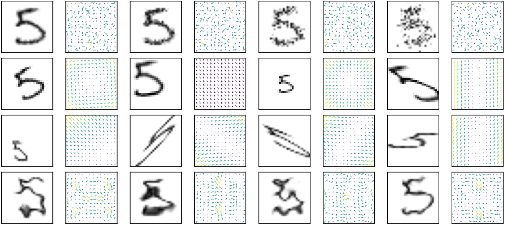

# DeformRS: Certifying Input Deformations with Randomized Smoothing .

This is the official code for the work titled: "DeformRS: Certifying Input Deformations with Randomized Smoothing".

This work is accepted to AAAI Conference on Artificial Intelligence (AAAI'22) [oral].

prerprint: [arxiv.org/pdf/2107.00996.pdf](https://arxiv.org/pdf/2107.00996.pdf)



### Environment Installation.

To reproduce our results, first you need to install our environment by running the following line from the main directory:

```
conda env create -f deform_rs.yml
```

Then, activate our environment by running:

```
conda activate deform_rs
```

### Training the base classifier. 

To train the base classifier with augmentation using one of the deformations mentioned in the paper, we give the following example for rotation augmentation on CIFAR10 where the augmentation is samples from uniform distribution [-pi/2, pi/2].

```
python train.py \
--sigma 0.5 \
--model resnet18 \
--dataset cifar10 \
--aug_method rotation \
--experiment_name reproducing_cifar10_rotation \
--epochs 90 --lr 0.1 --step_sz 30 --batch_sz 256
```

Note that there are 3 dataset choices, 2 architectures and 7 augmentation methods. 

```
dataset_choices = ['mnist', 'cifar10', 'imagenet']
model_choices = ['resnet18', 'resnet50']
aug_choices = ['nominal', 'gaussianFull', 'rotation', 'translation', 'affine', 'scaling_uniform', 'DCT']
```

Note that the parameter `--sigma` is expected to be between 0 and 1. For rotaiton experiments only, we multiply `sigma` by `pi` internally in the code. The output of this model is saved in `output/train/reproducing_cifar10_rotation/FinalModel.pth.tar`.

### Certifying the smooth classifier. 

To certify the trained classifier, run the following command:

```
python certify.py --uniform \
--sigma 0.5 \
--model resnet18 \
--dataset cifar10 \
--certify_method rotation \
--experiment_name reproducing_cifar10_rotation \
--base_classifier output/train/reproducing_cifar10_rotation/FinalModel.pth.tar
```

Note that the `certify.py` code will assume by default the the smoothing is gaussian unless `--uniform` is passed (rotation and scaling experiments are done with uniform smoothing). The output of this run is a `.txt` file contatining the certification results (saved in `output/certify/reproducing_cifar10_rotation/certification_chunk_1out_of1.txt`) in the following format:

```
idx	label	predict	radius	correct	time
```

where:

- `idx`: index of the instance in the test set.
- `label`: ground truth label for that instance.
- `predict`: predicted label for that instance.
- `radius`: the certified radius of that instance.
- `correct`: a flag that shows whether the instance is correctly classified or not.
- `time`: time required to certify that instance.

Hence, to compute the certified accuracy at a radius R, you need to compute the percentage of the test set that is both classified correctly and have a radius that is at least R.


## Citation

If you use this repo, please cite us:

```
@misc{alfarra2021deformrs,
      title={DeformRS: Certifying Input Deformations with Randomized Smoothing}, 
      author={Motasem Alfarra and Adel Bibi and Naeemullah Khan and Philip H. S. Torr and Bernard Ghanem},
      year={2021},
      eprint={2107.00996},
      archivePrefix={arXiv},
      primaryClass={cs.LG}
}
```

This repository is licensed under the terms of the MIT license.
